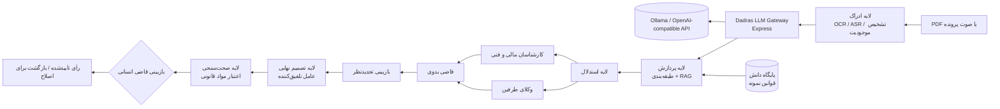

# معماری دموی دادرس



## مرزهای سیستم

| لایه | مسئولیت در دمو | جایگزین عملیاتی آینده |
|---|---|---|
| ادراک | شبیه‌سازی خوانش سند و تشخیص اشخاص | OCR/ASR ایزوله، حذف PII، ذخیره رمزنگاری‌شده |
| پردازش | طبقه‌بندی و بازیابی قوانین نمونه | embedding فارسی، Vector DB و نسخه‌بندی قوانین |
| استدلال | درخواست واقعی ترتیبی به مدل محلی/API و انتقال خروجی قبلی | LangGraph با اجرای موازی و ثبت trace |
| تصمیم نهایی | تلفیق گزارش‌ها و رفع تعارض | مدل محدودشده با schema خروجی و سیاست ارجاع انسانی |
| صحت‌سنجی | کنترل نمایشی وجود و ارتباط استناد | رجیستری رسمی قوانین، تاریخ اثر و کنترل نسخه |

## ساختار پروژه

```text
.
├── src/
│   ├── App.tsx       # صفحات، تعامل‌ها و state machine اجرا
│   ├── data.ts       # پرونده‌ها، عامل‌ها و قوانین ساختگی
│   ├── types.ts      # قراردادهای داده‌ای
│   ├── styles.css    # سیستم طراحی RTL و واکنش‌گرا
│   └── main.tsx      # نقطه ورود React
├── server/
│   └── index.mjs     # gateway مدل، تست اتصال و endpoint عامل‌ها
├── ARCHITECTURE.md   # معماری و مسیر عملیاتی‌سازی
├── README.md         # راهنمای اجرا
└── package.json
```

## اصول ایمنی برای نسخه واقعی

1. هیچ رأیی بدون تأیید و امضای انسان صادر نشود.
2. متن کامل ورودی، prompt، نسخه مدل، نتایج بازیابی و تصمیم هر عامل audit شود.
3. داده قضایی در استقرار خصوصی، با رمزنگاری و کنترل دسترسی مبتنی بر نقش نگهداری شود.
4. استنادها بر اساس نسخه و تاریخ اثر قانون اعتبارسنجی شوند، نه صرفاً شباهت برداری.
5. کاربر همیشه میزان اطمینان، تعارض عامل‌ها و موارد نیازمند بررسی را ببیند.
